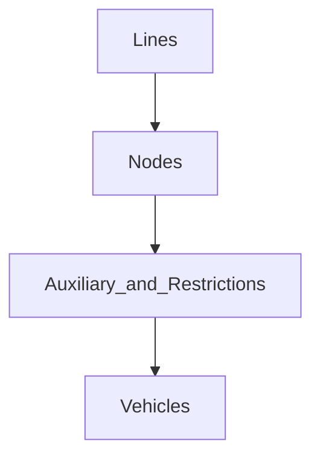
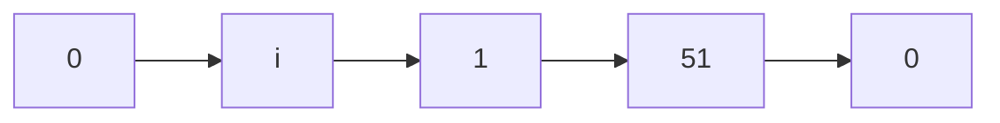
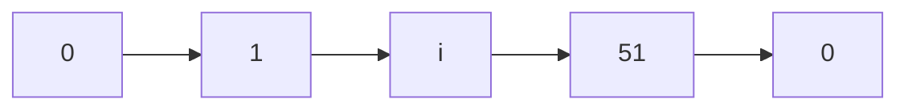
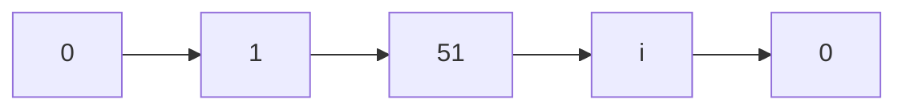
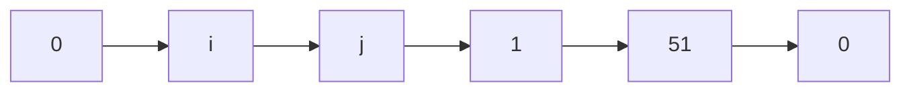
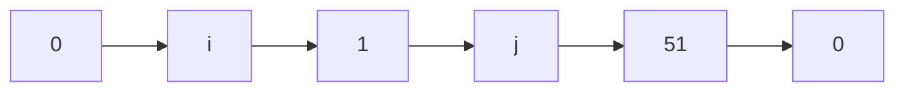
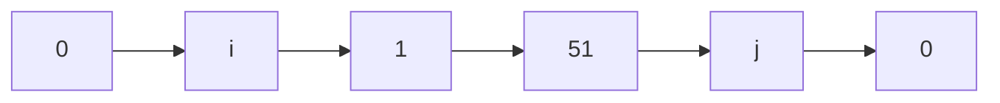
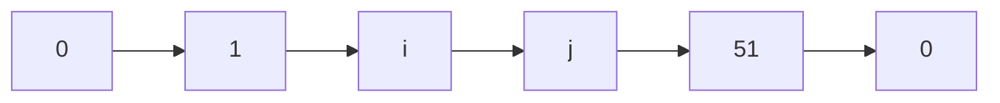
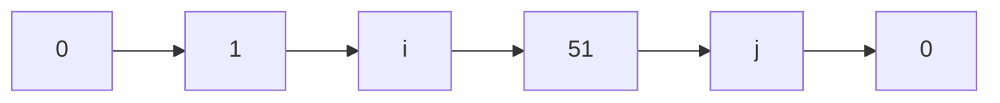
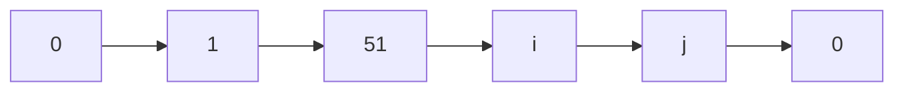

# Macroentrega 2: Implementação do algoritmo

## Explicação e divisão das classes do Algoritmo

Os programas da implementação do algoritmo são: gerador_rotas.cpp e classes.h

Em gerador_rotas.cpp o usuário interage com o algoritmo, este se baseia nas classes de classes.h

`As classes foram separadas em quatro:`
* Lines
* Nodes
* Auxiliary_and_Restrictions
* Vehicles

`As classes são hierárquicas, a ordem de hierarquia é apresentada a seguir:`

`A classe Lines tem como principal função:`
* Ler as dez primeiras linhas do arquivo de entrada.

`A classe Nodes tem como principais funções:`
* Ler todos os nohs da instância, ou seja, a parte NODES do arquivo de entrada;
* Analisa se os NODES respeitam os campos CAPACITY, ROUTE_TIME e p e d;
* Armazenar as distâncias entre pares de vértices da instância, ou seja, ler a parte EDGES do arquivo de entrada.

`A classe Auxiliary_and_Restrictions tem como principais funções:`
* Verificar se alguma rota respeita as restrições 1, 2, 3 e 6 ou 2, 3 e 6;
* Calcular o tempo de alguma rota;
* Marcar os nohs como visitados e remover/retornar o pacote atual sendo analisado na rota;
* Utilizado para realizar as funções de swap de vértices e algoritmo 2_opt.

`A classe Vehicles tem como principais funções:`
* Guardar/imprimir/calcular_tempo/atualizar/inserir_pedido/redimensionar as rotas de todos os veículos;
* Utilizado para realizar a função da heurística construtiva, baseado na inserção mais barata;
* Gera um arquivo .txt com as rotas de todos os veículos.

## Lógica do Algoritmo

A lógica do algoritmo não segue o pseudocódigo descrito na macroentrega 1, porém segue o pseudocódigo do Algorithm 3 Sequential Insertion, retirado do mesmo artigo
para a realização do PDF da macroentrega 1. Caso o professor queira analisar, o artigo está disponível em: https://www.mdpi.com/2227-7390/10/22/4308

A ideia é começar com rotas vazias.

Cria-se um rota inicial com um pedido qualquer (no caso do algoritmo o "pedido qualquer" é o primeiro do vector<pair<int, int>> pedidos).

Tenta-se inserir um pacote (vértice de coleta + seu vértice de entrega respectivo) na rota criada, baseado na heurística construtiva de inserção mais barata.

Suponha uma rota inicialmente vazia, inserimos o primeiro pacote nessa rota. Em cada posição que faça sentido, tenta-se inserir um ponto de coleta.

Possíveis inserções na rota acima (sendo i um vértice de coleta):

Para cada inserção, testa-se se a rota respeita as restrições 2, 3 e 6. Se ela respeita, então calcula-se o custo baseado na heurística de inserção mais barata.

Baseado em tal rota gerada, tentamos agora inserir o ponto de entrega respectivo ao ponto de coleta inserido.

As possíveis inserções do ponto de entrega para as rotas acima são (sendo j um vértice de entrega respectivo ao vértice i):

Para cada inserção, testa-se se a rota respeita as restrições 2, 3 e 6.

Perceba que a criação da rota seguindo essa lógica sempre respeita as restrições 1, 4 e 5.

`Se a rota respeita as restrições 2, 3 e 6 calcula-se uma prioridade da rota, tal prioridade é calculada da seguinte maneira:`
* Em uma trajetória x -> y, ao chegarmos em y antes de etw do mesmo, a prioridade é somada em 1;
* Na mesma trajetória, ao chegarmos em y entre o etw e ltw do mesmo, a prioridade é somada em 2.

Calcula-se o custo baseado na heurística de inserção mais barata.

Sempre que a prioridade for melhor e o custo também for melhor que a rota anterior analisada, guarda-se tal rota, a fim de retorná-la ao programa principal.

Realiza-se tal lógica até que o melhor pacote seja inserido na melhor posição da rota.

`Voltando ao programa principal, se a rota criada pela heurística é viável (não vazia), utiliza-se outros dois algoritmos para otimizar a rota:`
* swap: muda dois vértices da rota de lugar e calcula se a nova rota tem tempo melhor (e se respeita as restrições 1, 2, 3 e 6) que a rota antiga 
(faz tal lógica para todos os vértices da rota, exceto swaps com o vértice 0);
* 2-opt.

Após os processos acima, retira-se o melhor pacote do vector<pair<int, int>> pedidos. Repete-se todos os passos, até que tal vector esteja vazio.

## Como utilizar o algoritmo

Basta executar o arquivo gerador_rotas.cpp, o header classes.h deve estar dentro da pasta juntamente com o primeiro arquivo.

É de responsabilidade do professor/usuário ter a pasta instances com todas as instâncias desse projeto.

Ao compilar e executar o código, perceberá que não há segredo em o que fazer logo depois.

Ao final do programa é gerado automaticamente um arquivo, chamado solucao_gerada.txt, com todas as rotas da instância digitada pelo usuário.

## Soluções encontradas

Foi disponibilizado nessa pasta um arquivo chamado resultados_gerais.txt, onde o professor (e qualquer outra pessoa 😑) pode comparar a quantidade de veículos 
e custo encontrado de cada instância desse projeto com os valores melhores já conhecidos.
